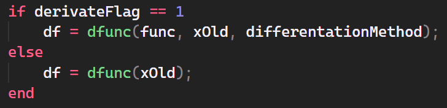
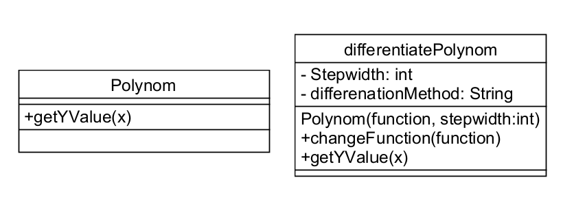
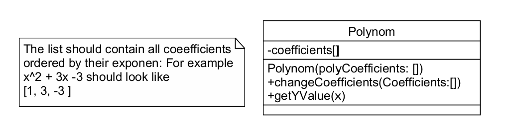

# Verbesserungsvorschlag für Architektur

Da in der Aufgabenstellung explizit zwei FUnktionen gefordert waren, wurde dieser Vorschlag nur konzipiert, nicht aber implementiert.

In der aktuellen Version hat die Funktion *numdif* einen anderen Funktionskopf als die herlömmliche Funktion des Polynoms.
Deswegen wird in dem Code- Teil, in dem auf eine fehlende Abeitungsfunktion geprüft wurde, ein Flag gesetzt, welches dem Algorithmus mitteilt, einen anderen FUnktionsaufruf zu startet.

Das kann gelöst werden, indem die Polynome nicht als Funktion, sondern als Klasse implementiert werden.
Wird der Newton- Funktion diese Klasse als Parameter übergeben wird, sind alle wichtigen Parameter bereits über den Konstruktor übergeben und es kann eine einheitliche Methode zur Berechnung benutzt werden.

Im obigen Klassendiagramm ist dargestellt, dass der Algorithmus bei beiden Funktionen nur die Methode getYValue aufrufen muss. Diese Methode ist bei beiden Polynomen identisch.

In diesem Klassendiagramm muss allderdings das Polynom von Hand in die Klasse geschrieben werden. Um dir Klasse wederverwendbarer zu machen, kann man den Konstruktor so ändern, dass die Koeffizienten des Polynoms sortiert nach dem Exponenten übergebenw werden.
Diese können so abgespeichert werden.
In der Methode getYValue(x) werden diese dann zusammen mit dem x-Wert in die Matlab- interne Funktion <code>polyval(list_of_coefficients, x)</code> eingetragen. Ein Vorschlag für die Implementation ist im unteren Klassendiagramm:

